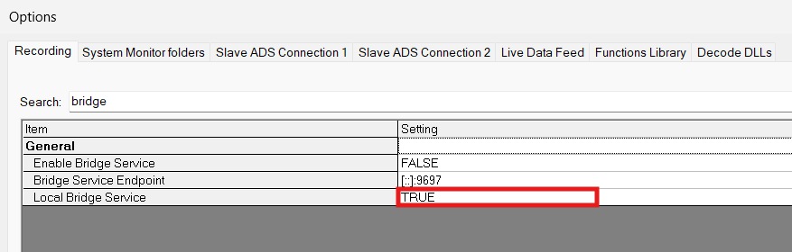
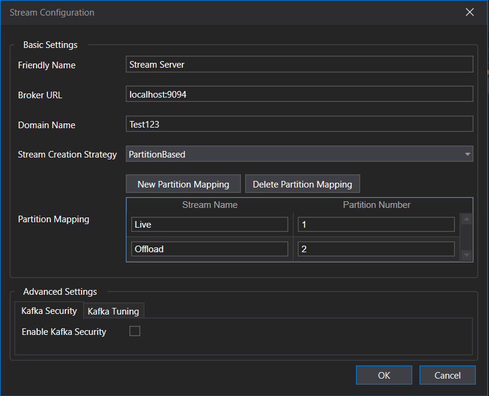

# Local Streaming — Bridge + Kafka (Local Machine)

This setup is for **local machine use only**. The Docker Compose file spins up **Kafka** and **Kafka UI** locally, and the local **Bridge Service** (configured via `Bridgeconfig.json`) publishes ADS telemetry into Kafka so ATLAS can consume it — all on the same machine. This keeps things simple: no VMs, no overlay network, no remote IPs.

---

## Files

| File | Purpose |
|------|---------|
| `docker-compose.yml` (kafka-compose) | Deploys the Kafka broker and Kafka UI containers locally. |
| `Bridgeconfig.json` | Bridge Service configuration — connects to local Kafka and maps ADS streams to partitions. |

---

## Endpoints

| What | Address |
|------|---------|
| Kafka UI | `localhost:8080` |
| Kafka external listener (Bridge / ATLAS connect here) | `localhost:9094` |
| Kafka internal listener (container-to-container) | `kafka:9092` |

---

## 1. Deploy the containers

From the folder containing the compose file, run:

```bash
docker compose up -d
```

This starts:

- **kafka-broker-1** — the Kafka broker (KRaft mode, single node)
- **kafka-ui-1** — the web UI

Verify everything is up:

```bash
docker compose ps
```

Open the Kafka UI in a browser to confirm the cluster is healthy:

```
http://localhost:8080
```

---

## 2. Bridge configuration

The local Bridge Service reads `Bridgeconfig.json`. Key settings:

- **`BrokerUrl`: `localhost:9094`** — the Bridge connects to Kafka's external listener.
- **`Domain`: `Test123`** — this must **match** the domain configured in the ATLAS Stream Recorder.
- **`StreamCreationStrategy`: `1`** — must be the **same** on both the Bridge and ATLAS side.
- **`PartitionMappings`** — maps streams to Kafka partitions:
  - `Live` → partition `1`
  - `Offload` → partition `2`

---

## 3. ADS → Kafka → ATLAS setup

Once the containers are running, run the end-to-end flow:

1. **Turn on the local Bridge** in ADS via **Tools → Options → Recording**. Search for `bridge` and set **Local Bridge Service** to `TRUE`.

   

2. **Start the containers** (if not already running):
   ```bash
   docker compose up -d
   ```
3. **Map and run the telemetry** in ADS to publish packets to Kafka.
4. **Read it in ATLAS** by setting up the **Stream Recorder** via **Tools → Options → Stream Recorder**. Open the **Stream Configuration** dialog and set:
   - **Broker URL:** `localhost:9094`
   - **Domain Name:** must match `Bridgeconfig.json`
   - **Stream Creation Strategy:** must match the Bridge
   - **Partition Mapping:** `Live` → `1`, `Offload` → `2` (same as the Bridge)
   - Click **OK**, then start the Stream Recorder and confirm it subscribes to the topics.

   

---

## 4. Verify data is flowing

Check that topics appear in **Kafka UI** (`localhost:8080`), or list them from the broker:

```bash
docker exec -it kafka-broker-1 \
  /opt/kafka/bin/kafka-topics.sh \
  --bootstrap-server localhost:9092 --list
```

You should see the `Test123` system and data topics once ADS starts publishing. If parameters don't show in ATLAS, first confirm the data topics exist in Kafka and that the Stream Recorder **domain matches** the Bridge.
