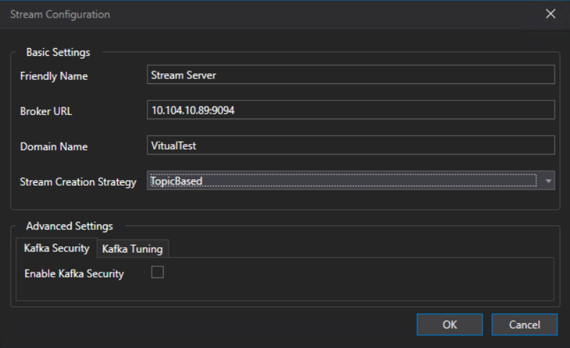
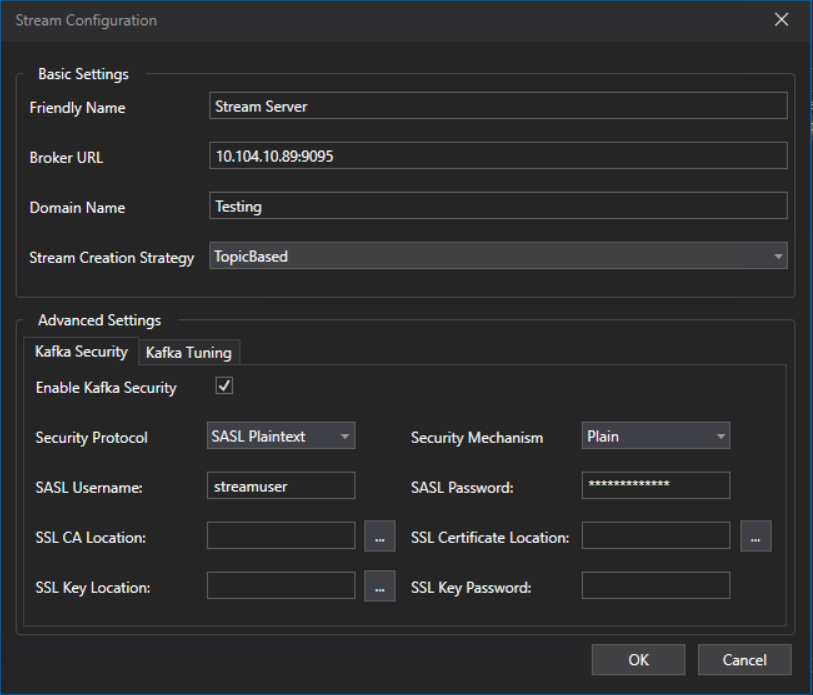
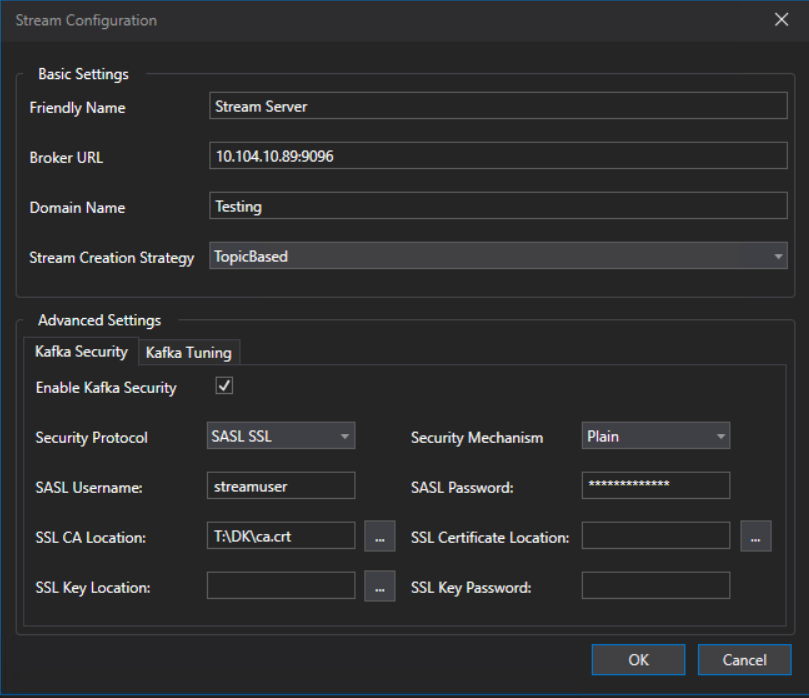
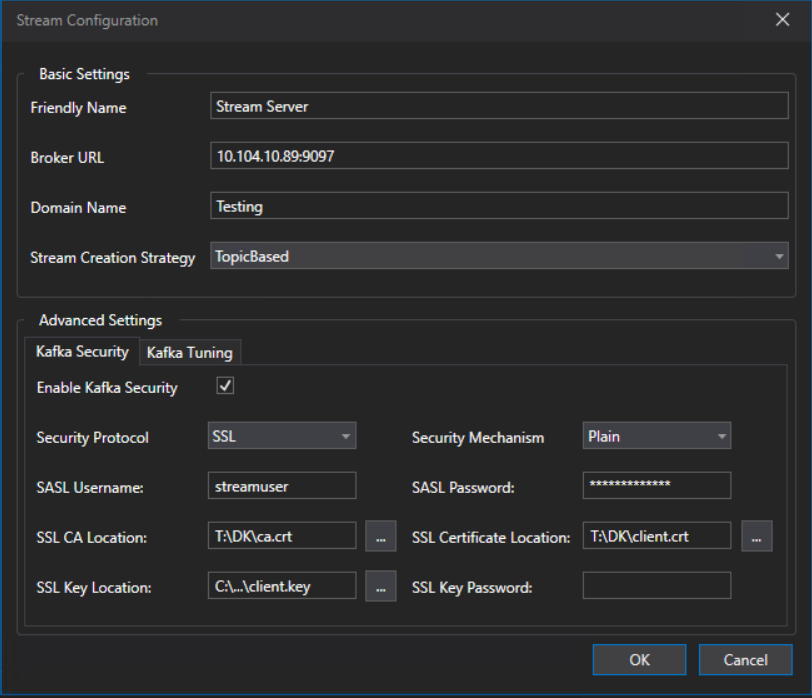
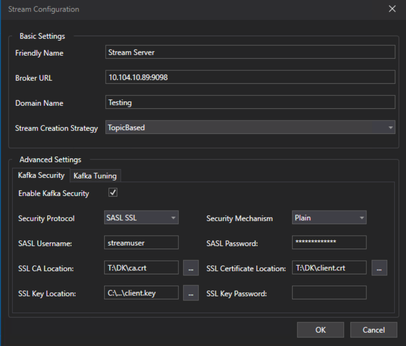
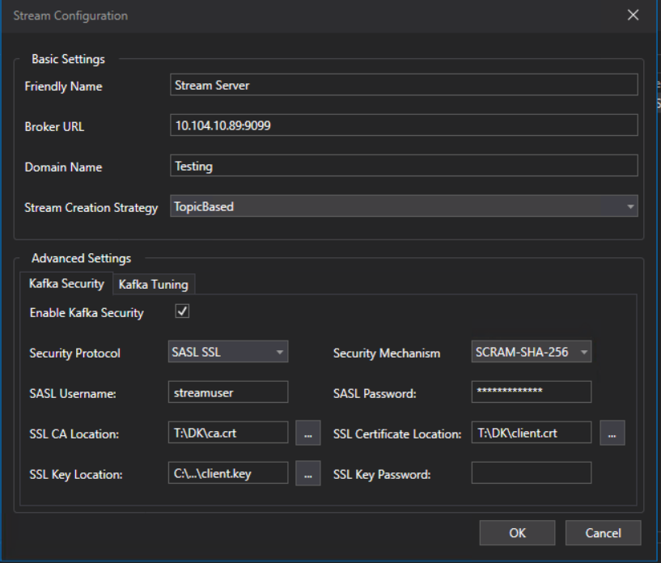

# Unified Broker

A centralized Kafka broker for Docker Swarm. One stack exposes **every supported
security posture on its own port simultaneously**, so the broker is deployed once and a
client moves between postures by changing only its own configuration.

The existing `PLAINTEXT` listeners are left byte-for-byte unchanged, so Bridge Service,
VPS, Gateway and Kafka UI keep running against the unsecured listener while the secured
listeners sit alongside them unused. That makes this the low-risk path for securing a
running system: add a listener, move clients across one at a time, then retire
plaintext.

For the list of security postures and how this compares to the
[Fragmented Broker](../Fragmented%20Broker/) approach, see the
[root README](../../README.md).

---

## Folder Contents

| Item | File | What it is and why it's here |
|---|---|---|
| **Kafka Unified Compose** | `docker-compose.kafka-secure.yml` | The Swarm stack definition for the Kafka broker and Kafka UI, declaring all seven listeners at once. It exists as a drop-in replacement for an existing plaintext-only `docker-compose.kafka.yml` — the two plaintext listeners are preserved exactly, so deploying it secures nothing until a client opts in. |
| **Bridge Compose File** | `docker-compose.bridge-secure.yml` | The Swarm stack definition for the Bridge node — Bridge Service, Virtual Parameter Service and Gateway Service — each with a `Security` block. It exists so a client's posture can be changed and redeployed independently of the broker. Ships configured for SASL/PLAIN over TLS. |
| **Certificate Generator (Linux)** | `generate-certs.sh` | Creates the example CA, the broker keystore and truststore, and the client certificates, writing them to `./secrets`. It exists because every TLS posture needs a certificate chain whose SANs cover the addresses clients actually use; generating them is a prerequisite, not a deployment step. |
| **Certificate Generator (Windows)** | `generate-certs.ps1` | The same generator for native PowerShell, so certificates can be produced on a Windows machine without Git Bash or WSL. Output is identical to the shell version. |
| **SCRAM User Bootstrap** | `create-scram-users.sh` | Creates the SCRAM credentials in cluster metadata. It exists only for the SCRAM posture, and only works while a plaintext listener is still available to authenticate the request that creates the first user. |
| **Config Files** | `kafka_server_jaas.conf` | Broker JAAS configuration. Kafka requires a JAAS *entry* to exist for a SCRAM-enabled listener even though the credentials themselves live in cluster metadata; without it the broker refuses to start. It is version-controlled at the folder root because the generated `secrets/` directory is gitignored, and must be staged alongside the certificates. |
| | `docker-compose.local-preflight.yml` | The same broker configuration expressed for plain `docker compose` on a single machine. Optional — it exists to validate a broker config change on a laptop before it reaches the Swarm. |
| | `.gitignore` | Excludes the generated `secrets/` directory so keys and certificates are never committed. |
| **Client screenshots** | `Port9094.png` | ATLAS Stream Configuration for the existing plaintext listener — **Enable Kafka Security** unchecked. |
| | `Port9095.png` | Same dialog for SASL/PLAIN with no TLS — security enabled, `SASL Plaintext` + `Plain`, no SSL paths. |
| | `Port9096.png` | Same dialog for SASL/PLAIN over TLS — `SASL SSL` + `Plain` with a CA path only, no client certificate. |
| | `Port9097.png` | Same dialog for mTLS only — `SSL` with CA, client certificate and client key. |
| | `Port9098.png` | Same dialog for SASL/PLAIN over TLS **plus** a client certificate — `SASL SSL` + `Plain` with all three paths. |
| | `Port9099.png` | Same dialog for SCRAM over TLS plus a client certificate — `SASL SSL` + `SCRAM-SHA-256` with all three paths. |

The six screenshots exist so the **client** side of every posture can be copied from a
known-good example rather than inferred from the broker config. Each one is shown inline
beside the matching YAML under
[Switching a Client to a Secured Listener](#switching-a-client-to-a-secured-listener).

> The broker configuration in `docker-compose.kafka-secure.yml` was verified end-to-end
> on single-node Docker before being committed: all seven listeners bound, and a
> SASL_SSL create-topic/list round-trip succeeded. Two bugs found during that check are
> recorded under [Troubleshooting](#troubleshooting).

---

## Port Map

| Port | Listener | Protocol | Mechanism | Client cert | Posture |
|---|---|---|---|---|---|
| 9092 | `PLAINTEXT` | PLAINTEXT | — | — | **existing / production + inter-broker** |
| 9093 | `CONTROLLER` | PLAINTEXT | — | — | KRaft internal |
| 9094 | `PLAINTEXT_HOST` | PLAINTEXT | — | — | **existing** external (`10.104.10.89`) |
| 9095 | `SASLPLAIN` | SASL_PLAINTEXT | PLAIN | no | 1 |
| 9096 | `SASLSSL` | SASL_SSL | PLAIN | no | **2 — start here** |
| 9097 | `MTLS` | SSL | — | **required** | 3 |
| 9098 | `SASLMTLS` | SASL_SSL | PLAIN | **required** | 4 |
| 9099 | `SCRAMMTLS` | SASL_SSL | SCRAM-SHA-256 | **required** | 5 |

Ports 9095–9099 are **in-swarm only** (`kafka:<port>`) as shipped. Every service client
already runs on the overlay network, so no new host ports or firewall rules are needed —
see [Reaching the secured ports from a desktop client](#reaching-the-secured-ports-from-a-desktop-client)
if ATLAS has to connect from outside.

The client configuration for each row is shown as an ATLAS Stream Configuration
screenshot under [Switching a Client to a Secured Listener](#switching-a-client-to-a-secured-listener).

---

## Setup

### 1. Generate certificates (once)

Run anywhere with `openssl` + `docker` — a laptop is fine.

```bash
./generate-certs.sh
```

Windows PowerShell:

```powershell
$env:OPENSSL_CONF = "C:\Program Files\Git\mingw64\etc\ssl\openssl.cnf"
.\generate-certs.ps1
```

> The `OPENSSL_CONF` line is not optional if the machine has Strawberry Perl installed —
> PowerShell resolves its `openssl.exe` ahead of Git's, and that build looks for a
> config file at a path that doesn't exist, failing on the very first command. Check
> with `Get-Command openssl -All`.

Verify the SAN covers the Kafka node:

```bash
openssl x509 -in secrets/kafka.crt -noout -text | grep -A1 "Subject Alternative Name"
# DNS:kafka, DNS:localhost, IP Address:127.0.0.1, IP Address:10.104.10.89
```

If clients will reach Kafka by any other name or IP, add it before generating:

```bash
EXTRA_SANS="DNS:kafka.internal,IP:10.104.10.90" ./generate-certs.sh
```

Getting this wrong is the single most likely cause of a TLS failure that looks like a
broker fault. Never "fix" it by disabling hostname verification.

### 2. Stage certificates on both nodes

Swarm does **not** copy local files to remote nodes. A relative `./secrets` bind mount
would silently produce an empty directory inside the container.

Copy `kafka_server_jaas.conf` into `secrets/` before staging — the broker mounts the
whole directory at `/etc/kafka/secrets` and expects the JAAS file there.

**Kafka node** (needs everything, owned by uid 1000 — same as the data dir):

```bash
scp -r secrets ocsautotest@<kafka-node>:/home/ocsautotest/docker-composes/Kafka/
ssh ocsautotest@<kafka-node> \
  'sudo chown -R 1000:1000 /home/ocsautotest/docker-composes/Kafka/secrets'
```

**Bridge node** (only needs `ca.crt`, plus `client.crt`/`client.key` for the mTLS
postures 3–5):

```bash
scp -r secrets ocsautotest@<bridge-node>:/home/ocsautotest/docker-composes/Bridge/
```

> `docker secret` is the tidier long-term answer. Bind mounts are used here because they
> match the pattern already in the Kafka stack, which keeps the number of new concepts
> at zero.

### 3. Deploy the Kafka stack

```bash
docker stack deploy -c docker-compose.kafka-secure.yml kafka
docker service logs -f kafka_kafka
```

Look for seven `Awaiting socket connections on 0.0.0.0:<port>` lines, then
`Kafka Server started`.

**Nothing has broken at this point.** `PLAINTEXT:9092` and `PLAINTEXT_HOST:9094` are
unchanged, so every existing client keeps running exactly as before.

Confirm via Kafka UI at `http://<kafka-node>:8080` — two clusters now appear:

- **local-plaintext** (`:9092`) — the existing view, should be Online
- **local-saslssl** (`:9096`) — proves posture 2 works with zero application changes

If `local-saslssl` is Online, the TLS and SASL plumbing is correct before any
application service is touched.

### 4. Create SCRAM users (posture 5 only)

Run **on the Kafka node**, after the stack is up:

```bash
./create-scram-users.sh
```

This works because `:9092` is still unauthenticated, giving a path in to create the
first credentials. That is precisely the chicken-and-egg problem the
[fragmented SCRAM example](../Fragmented%20Broker/SASL%20or%20SCRAM-SHA-256%20+%20mTLS/) has
to work around with a `kafka-init` container and `--add-scram` at format time — and that
workaround relies on `depends_on`, which `docker stack deploy` ignores. Keeping the
plaintext listener makes the whole problem disappear.

---

## Switching a Client to a Secured Listener

Edit `docker-compose.bridge-secure.yml` and redeploy:

```bash
docker stack deploy -c docker-compose.bridge-secure.yml bridge
```

It ships configured for **posture 2**. To change posture, set `BrokerUrl` and the
`Security__*` block on each of the three Kafka clients.

Each posture below shows both sides of the same change: the **YAML** for the Swarm
services, and the **ATLAS Stream Configuration** dialog for a desktop client. The
screenshots come from a working session, so they double as a reference for which fields
matter and which stay empty.

> In every screenshot, **Domain Name** and **Stream Creation Strategy** must match the
> publishing Bridge Service. They are unrelated to security, but a mismatch there looks
> exactly like a connection problem: the client connects cleanly and then sees no data.

### Baseline — existing plaintext listener, no security

Nothing to configure beyond the broker address. **Enable Kafka Security** stays
unchecked, which is how every client runs before and during the migration.



Ticking that checkbox reveals the Security Protocol, Mechanism, SASL and SSL fields used
by all five postures below.

### Posture 1 — SASL/PLAIN, no TLS
```yaml
StreamApiConfig__BrokerUrl: "kafka:9095"
StreamApiConfig__Security__Protocol: "SaslPlaintext"
StreamApiConfig__Security__Mechanism: "Plain"
StreamApiConfig__Security__SaslUsername: "streamuser"
StreamApiConfig__Security__SaslPassword: "stream-secret"
```

Username and password only — all three SSL path fields stay empty, since there is no
TLS on this listener.



### Posture 2 — SASL/PLAIN over TLS, no client cert *(default)*
```yaml
StreamApiConfig__BrokerUrl: "kafka:9096"
StreamApiConfig__Security__Protocol: "SaslSsl"
StreamApiConfig__Security__Mechanism: "Plain"
StreamApiConfig__Security__SaslUsername: "streamuser"
StreamApiConfig__Security__SaslPassword: "stream-secret"
StreamApiConfig__Security__SslCaLocation: "/etc/kafka/secrets/ca.crt"
```

Same credentials as posture 1 plus **SSL CA Location**. The certificate and key fields
stay empty — this listener verifies the broker to the client, not the other way round.



### Posture 3 — mTLS only, no SASL
```yaml
StreamApiConfig__BrokerUrl: "kafka:9097"
StreamApiConfig__Security__Protocol: "Ssl"
StreamApiConfig__Security__SslCaLocation: "/etc/kafka/secrets/ca.crt"
StreamApiConfig__Security__SslCertificateLocation: "/etc/kafka/secrets/client.crt"
StreamApiConfig__Security__SslKeyLocation: "/etc/kafka/secrets/client.key"
```

All three certificate paths are required; identity comes from the certificate subject.



> The dialog still shows a Mechanism, username and password in this screenshot. With
> **Security Protocol** set to `SSL` they are ignored — authentication is the client
> certificate alone. Leaving stale values there is harmless but misleading; the YAML
> above omits them deliberately.

### Posture 4 — SASL/PLAIN over TLS + client cert
```yaml
StreamApiConfig__BrokerUrl: "kafka:9098"
StreamApiConfig__Security__Protocol: "SaslSsl"
StreamApiConfig__Security__Mechanism: "Plain"
StreamApiConfig__Security__SaslUsername: "streamuser"
StreamApiConfig__Security__SaslPassword: "stream-secret"
StreamApiConfig__Security__SslCaLocation: "/etc/kafka/secrets/ca.crt"
StreamApiConfig__Security__SslCertificateLocation: "/etc/kafka/secrets/client.crt"
StreamApiConfig__Security__SslKeyLocation: "/etc/kafka/secrets/client.key"
```

Every field in use at once: credentials **and** all three certificate paths. Both layers
must pass.



### Posture 5 — SASL/SCRAM-SHA-256 over TLS + client cert
```yaml
StreamApiConfig__BrokerUrl: "kafka:9099"
StreamApiConfig__Security__Protocol: "SaslSsl"
StreamApiConfig__Security__Mechanism: "ScramSha256"
StreamApiConfig__Security__SaslUsername: "streamuser"
StreamApiConfig__Security__SaslPassword: "stream-secret"
StreamApiConfig__Security__SslCaLocation: "/etc/kafka/secrets/ca.crt"
StreamApiConfig__Security__SslCertificateLocation: "/etc/kafka/secrets/client.crt"
StreamApiConfig__Security__SslKeyLocation: "/etc/kafka/secrets/client.key"
```

Identical to posture 4 apart from **Security Mechanism**, which becomes
`SCRAM-SHA-256`. This is the only posture that needs
[SCRAM users created first](#4-create-scram-users-posture-5-only).



### Reaching the secured ports from a desktop client

The screenshots use `10.104.10.89:<port>`, but **the committed
`docker-compose.kafka-secure.yml` does not support that for 9095–9099**: only `9094` is
published to the host, and those five listeners advertise `kafka:<port>`, which a
machine outside the overlay network cannot resolve.

Reaching them from a desktop ATLAS client therefore needs two changes to the broker
stack — publishing the host ports, and advertising the node address rather than `kafka`
— and the certificate SANs must cover whichever address is advertised. In-swarm clients
such as the Bridge, VPS and Gateway need none of this and work against `kafka:<port>` as
shipped.

### Migrating one service at a time

For lowest risk, change **`gateway-service` first** (smallest blast radius), then
`virtual-parameter-service`, then `bridge-service`. Any service left on `kafka:9092`
keeps working — the listeners are independent.

---

## Verify

```bash
docker service ls
docker service logs -f bridge_bridge-service | grep -iE "kafka|sasl|ssl|error"
```

Then in Kafka UI (`local-plaintext` cluster, since it sees the same data), confirm
topics under the `VirtualTest.` prefix are still being written.

**A clean pass means:** the service starts without auth errors, topics keep receiving
data, and the broker log shows no `SSL handshake failed` or `Authentication failed`
entries.

### Negative tests — prove enforcement, not just acceptance

A connection succeeding only proves the config is right. These prove the broker is
actually enforcing:

| Test | Change | Expect |
|---|---|---|
| Wrong password | `SaslPassword: "wrong"` | SASL authentication failure |
| No security block | remove `Security__*`, keep secured port | Connection refused / handshake failure |
| Missing client cert (postures 3–5) | drop `SslCertificateLocation`/`SslKeyLocation` | TLS handshake rejected before SASL |
| Wrong CA | point `SslCaLocation` at an unrelated cert | Client-side trust failure |

---

## Rollback

Instant, and needs no Kafka change:

```yaml
StreamApiConfig__BrokerUrl: "kafka:9092"
# delete every StreamApiConfig__Security__* line
```

```bash
docker stack deploy -c docker-compose.bridge-secure.yml bridge
```

Security only activates when one of `SaslUsername` / `SslCaLocation` /
`SslCertificateLocation` is non-empty, so removing them is sufficient. The plaintext
listener never went away.

To revert the broker entirely, redeploy the original plaintext-only Kafka stack.

---

## Going to Production

Once a posture is validated:

1. Move **all** clients to the chosen secured listener.
2. Change `KAFKA_INTER_BROKER_LISTENER_NAME` to that listener.
3. Remove `PLAINTEXT` and `PLAINTEXT_HOST` from `KAFKA_LISTENERS`,
   `KAFKA_ADVERTISED_LISTENERS` and `KAFKA_LISTENER_SECURITY_PROTOCOL_MAP`.
4. Remove the now-unused secured listeners too — keep exactly one.
5. Move SASL passwords and the CIFS credentials to `docker secret`.

Step 3 is the only hard cutover, and by then everything else is proven.

> Note for step 3: with plaintext gone you lose the unauthenticated path used by
> `create-scram-users.sh`. Create SCRAM users **before** removing it, or plan to use
> `--add-scram` at format time.

---

## Troubleshooting

### Broker exits immediately: `configure: line 18: !1: unbound variable`

The image's `/etc/kafka/docker/configure` detects `SSL://` in
`KAFKA_ADVERTISED_LISTENERS` and then hard-requires `KAFKA_SSL_KEYSTORE_FILENAME`,
`KAFKA_SSL_KEYSTORE_CREDENTIALS` and `KAFKA_SSL_KEY_CREDENTIALS`. It runs under `set -u`,
so supplying `KAFKA_SSL_KEYSTORE_LOCATION` instead kills the container before Kafka
starts.

**Keystore must use FILENAME/CREDENTIALS. Truststore must be set directly** — the script
only wires up truststore indirection when the *global* `ssl.client.auth` is
`required`/`requested`, and ours is `none` because client certs are demanded
per-listener. Both are already correct in the provided file.

### Broker exits: `Could not find a 'KafkaServer' or 'scrammtls.KafkaServer' entry`

Kafka requires a JAAS entry to exist for a SCRAM-enabled listener even though the
credentials live in cluster metadata. Provided by `kafka_server_jaas.conf` plus the
`KAFKA_OPTS` line. Make sure that file was included when `secrets/` was copied to the
Kafka node.

### TLS fails only from outside the swarm

The broker cert SAN must include the address used. `10.104.10.89` is included by
default; anything else needs `EXTRA_SANS` at generation time.

### Client connects but no data appears

Almost certainly not a security problem — check `StreamApiConfig__Domain`
(`VirtualTest`) matches the topic prefix you're looking at in Kafka UI.

### `secrets` directory empty inside the container

Swarm doesn't copy local files to remote nodes. Confirm the absolute path exists **on
the target node** and is owned by uid 1000 on the Kafka node.

---

## Credentials Reference

| Username | Password | Used by |
|---|---|---|
| `admin` | `admin-secret` | Kafka UI, admin tooling |
| `streamuser` | `stream-secret` | Bridge Service, VPS, Gateway |

Certificate store password: `changeit` (override with `CERT_PASSWORD=...`).
`client.key` is unencrypted, so no `SslKeyPassword` is needed.

These are test credentials. Change them, and move them to `docker secret`, before any of
this becomes permanent.
